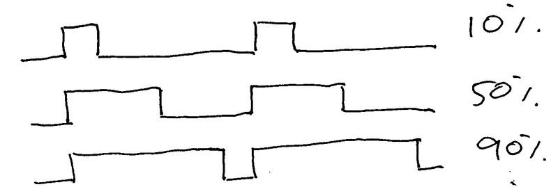
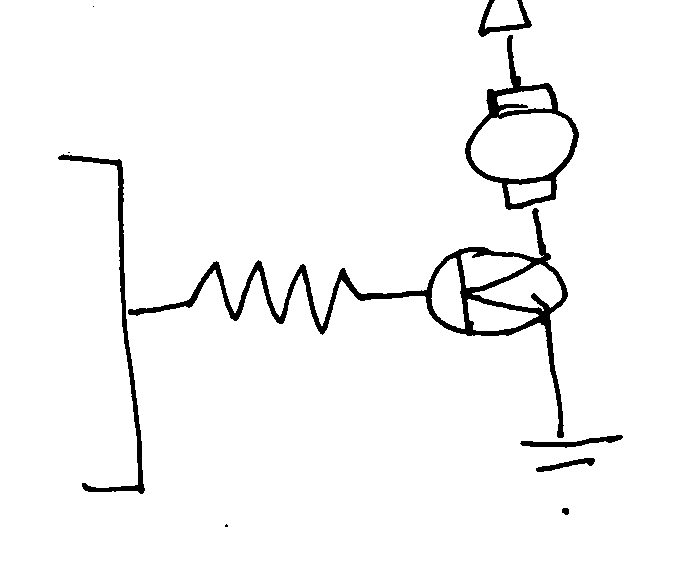
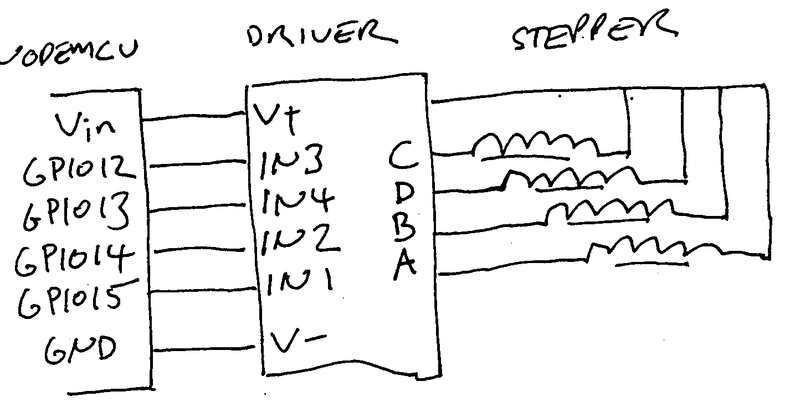

===============================
 MicroPython: Input and Output
===============================

This should work on either ESP8266 or ESP32 MicroPython, but the instructions are
written for ESP8266.  There are minor differences, eg: the numbers of pins and their
capabilities.

I/O Pins
========

The number of pins, and their capabilities, varies between ESP8266 and ESP32, and 
not all pins are available on all boards.

ESP8266 Boards
~~~~~~~~~~~~~~

Witty Cloud
-----------

The Witty Cloud development board has some hardware already on board, namely a 
three-colour LED and a light-dependent resistor.

:wq======= ============
ESP8266 Connection
======= ============
GPIO0   Flash button
GPIO2   Module LED
GPIO4   Pushbutton
GPIO12  Blue LED
GPIO13  Green LED
GPIO15  Red LED
======= ============

NodeMCU
-------

Note that if you're using a NodeMCU board, the pin numbers printed on the board
are not the same as the ESP8266 GPIO numbers.
See https://nodemcu.readthedocs.io/en/master/en/modules/gpio/

======= ===================== ================================
NodeMCU ESP8266 / MicroPython Notes
======= ===================== ================================
D0      GPIO16                Limited features, LED on NodeMCU
D1      GPIO5                 
D2      GPIO4                 
D3      GPIO0                 Connected to button
D4      GPIO2                 Connected to LED on module
D5      GPIO14                
D6      GPIO12                
D7      GPIO13                
D8      GPIO15                
D9      GPIO3                 UART RXD0 (used for console)
D10     GPIO1                 UART TXD0 (used for console)
D11     GPIO9                 (used for module flash memory)
D12     GPIO10                (used for module flash memory)
======= ===================== ================================

MicroPython I/O
===============

Digital Outputs
---------------

To control an output pin, you must first configure it.  The `machine` library
makes the pins available to your Python code, and let's you specify how you
want to use that pin.  To configure a pin as a digital output::

     import machine
     pin = machine.Pin(2, machine.Pin.OUT)

On NodeMCU, GPIO2 is connected to an on-board LED, so you should be able to turn
the LED on and off::

     pin(True)
     pin(False)

Of course you can do this in a loop to get 'blinky', the microcontroller equivalent
of 'hello world'::

     import machine
     import time

     pin = machine.Pin(2, machine.Pin.OUT)
     while True:
         pin(True)
         time.sleep(1)
         pin(False)
         time.sleep(1)

PWM Outputs
-----------

You can also turn the LED "partly on" by turning it on and off rapidly.  Doing this
in Python would be flickery and a waste of power, but thankfully there's hardware support
for pulse-width modulation (PWM).  This just means turning the pin on and off rapidly,
and it lets you set the proportion of the time the LED is on, called the 'duty cycle':

To configure a pin as PWM, wrap the `machine.Pin` object in a `machine.PWM` object::

    import machine
    pin = machine.Pin(2, machine.Pin.OUT)
    pwm = machine.PWM(pin)

    pwm.freq(1000)
    pwm.duty(512)

`freq` sets the frequency (in Hz) and `duty` sets the duty cycle between 0 (always off)
and 1023 (always on).  This lets you fade the LED in and out like so::

     import machine
     import time

     pin = machine.Pin(2, machine.Pin.OUT)
     pwm = machine.PWM(pin)
     pwm.freq(1000)

     while True:
         for d in range(10,90,10):
             pwm.duty(d/100)
             time.sleep(0.1)
         for d in range(90,10,-10):
             pwm.duty(d/100)
             time.sleep(0.1)

Yay, it's 'throbby', the microcontroller equivalent of "Hello, World!\n".

Digital Inputs
--------------

The NodeMCU also has a button, attached to GPIO0::

    import machine

    pin = machine.Pin(0, machine.Pin.IN)
    while True:
        if pin(): print "True"
        else: print "False" 
        
Analog Inputs
-------------

There's also an analog input pin, sadly only one on ESP8266::

    import machine

    adc = machine.ADC(0)
    while True:
        print adc.read()

Controlling Hardware
====================

DC motors 
---------

See also: https://en.wikipedia.org/wiki/Brushed_DC_electric_motor

DC motors turn when there's a voltage across them.  But they need more current than our
IO Pins can supply, so we need a driver to amplify the signals from the MCU. This could
be as simple as a single transistor switched from an I/O pin.

Then you can turn the motor on and off using the pin::

    pin_motor = machine.Pin(4, machine.Pin.OUT)

The motor can be driven at different speeds by varying the duty cycle, just like with the
LED::

    pin_motor = machine.Pin(4, machine.Pin.OUT)
    pwm_motor = machine.PWM(pin_motor)

The motor can also be driven backwards by reversing the direction.  Internally the driver
uses an H-Bridge to do this, but all we need to know is that it has a reverse pin::

    pin_motor = machine.Pin(4, machine.Pin.OUT)
    pwm_motor = machine.PWM(pin_motor)

    pin_reverse = machine.Pin(5, machine.Pin.OUT) 

.. image:: img/hbridge.png
   :width: 50%

Servos
------

Servos are very handy little units, consisting of a motor, a position sensor and a feedback
loop.  Rather than telling them which way to turn, you tell them what position you want them
to be in and they move to that position.  They are controlled by a train of pulses, for most
servos a pulse of 1.0 ms will turn the servo one way and a pulse of 2.0 ms will turn it the
other.  A pulse of 1.5 ms will put the servo in the middle.  Pulses must be received every
25 ms or so or the servo will turn off.  Servos are not all that precise, especially cheap
ones, so if you go past the acceptable range for the servo you may hear it whine as it tries
to move past its limits, or it may 'hunt' (wiggle back and forth) if it isn't happy with
the frequency of the pulses.

There are three pins:

========== ======= ===========
Wire color Purpose NodeMCU Pin
========== ======= ===========
Brown      Ground  GND
Red        Power   Vin
Orange     Signal  D4
========== ======= ===========

Thankfully this is easy enough to do with the PWM control.  Set the frequency to 100Hz (one
cycle per 10ms) and the duty cycle to between 0.1 (10ms * 0.1 = 1ms) and 0.2 (10ms * 0.2 = 2ms)
We can adapt the LED PWM code above::

    import machine
    import time

    pin = machine.Pin(2, machine.Pin.OUT)
    pwm = machine.PWM(pin)
    pwm.freq(100)

    while True:
        for d in range(100,200):
            pwm.duty(d)
            time.sleep(0.1)

Stepper Motors
--------------

Stepper motors have multiple separate coils, and unlike DC motors there's no brushes to switch
the current around and keep things spinning, instead you have to do it yourself.  The two
separate phases need to be controlled separately.

For more details: https://en.wikipedia.org/wiki/Stepper_motor

===== == == == ==
Phase A+ A- B+ B-
===== == == == ==
0     1  0  0  0
1     1  0  1  0
2     0  0  1  0
3     0  1  1  0
4     0  1  0  0
5     0  1  0  1
6     0  0  0  1
7     1  0  0  1
===== == == == ==

This means you have more work to do, but you also have more control::

    import machine
    import time

    pins = [
        machine.Pin(12, machine.Pin.OUT),  # 1
        machine.Pin(13, machine.Pin.OUT),  # 2
        machine.Pin(14, machine.Pin.OUT),  # 4
        machine.Pin(15, machine.Pin.OUT),  # 8
    ]

    phases = [ 1, 5, 4, 6, 2, 10, 8, 9 ]

    while True:
        for phase in phases:
            for n, p in enumerate(pins):
                pins[n](phase & 1<<n)
            time.sleep(0.001)

Wiring
~~~~~~

As a demo, I have some `28BYJ-48 4-phase unipolar geared stepper motors
<http://robocraft.ru/files/datasheet/28BYJ-48.pdf>` and
`ULN2003A <https://en.wikipedia.org/wiki/ULN2003A>`_  driver boards
to suit.  Despite being designed for 5V TTL logic these work well enough
on 3.3V CMOS.

Wire NodeMCU GND to V- and NodeMCU Vin to V+, and the logic pins as follows:

======= ======= ====== === =====
ESP8266 NodeMCU Driver LED Phase
======= ======= ====== === =====
GPIO12  D6      IN3    C   B-
GPIO13  D7      IN4    D   A-
GPIO14  D5      IN2    B   B+
GPIO15  D8      IN1    A   A+
======= ======= ====== === =====
