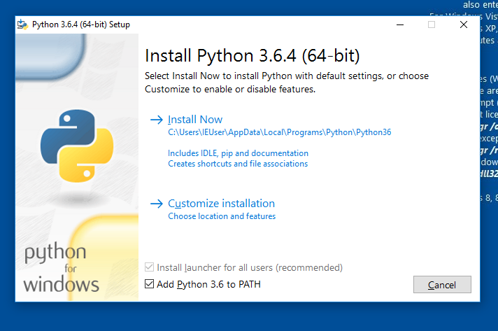
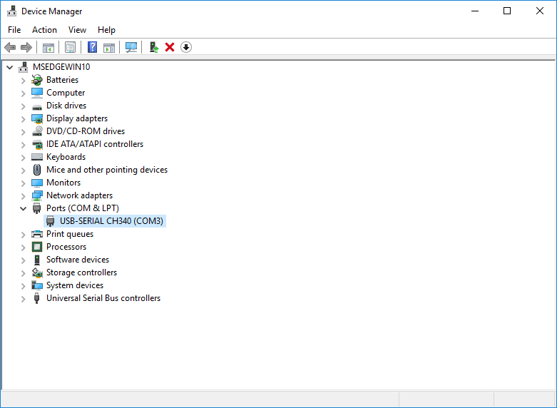

# Installing MicroPython for ESP8266 & ESP32

## 1. Download Firmware

Download prebuilt firmware from micropython.org:

* [MicroPython Firmware for ESP8266 boards](http://micropython.org/downloads#esp8266)
* [MicroPython Firmware for ESP32 boards](http://micropython.org/downloads#esp32)

Or if you cloned this repo, it's already here:

*  [ESP8266](bin/esp8266-20180104-v1.9.3-238-g42c4dd09.bin)
*  [ESP32](bin/esp32-20180104-v1.9.3-238-g42c4dd09.bin)

## 2. Install esptool

You need at least Version 2 of the esptool utility, and a USB port.

### Linux

Note that the vendor package esptool is horribly out of date on Ubuntu at least,
so you're better off installing from pypi.  The vendor package is generally installed
as `/usr/bin/esptool`, whereas the pypi version is generally installed as 
`/usr/local/bin/esptool.py`.  

Plug the board in to a USB port, and check for a device called `/dev/ttyUSB0` or
`/dev/ttyACM0` or similar.  If all else fails, check `dmesg` for USB events.

From a terminal, first add yourself to the group 'dialout' (or whatever group owns the
device):

    sudo addgroup $USER dialout
    exec newgrp dialout
    exec newgrp -

And then install esptool:

    sudo pip install esptool
    esptool.py version

### Mac OSX (10.11)

From terminal::

    sudo easy_install pip
    sudo pip install --upgrade esptool
    esptool.py version

Your device is called something like "/dev/cu.something" depending on the type of device.
When you find it, set up an environment variable so we don't have to keep typing it:

    export PORT=/dev/cu.usbserial

If you can't find any devices which look like that, you need to install third-party
"VCP" (Virtual COM Port) drivers for your device.  Typical locations:

* [FTDI VCP Drivers](http://www.ftdichip.com/Drivers/VCP.htm)
* [Silicon Labs VCP Drivers](http://www.silabs.com/products/development-tools/software/usb-to-uart-bridge-vcp-drivers)
* [CH340 VCP Drivers](http://www.wch.cn/download/CH341SER_MAC_ZIP.html)

Once you've done that, the device should appear in `/dev`.

### Windows 10

Download Python 3.6 from https://www.python.org/downloads/windows/

Run the installer, make sure "Add Python 3.6 to PATH" is selected (at the bottom) 
and then click Install Now.

Open a command shell (CMD.EXE, or BASH.EXE):

    pip install --upgrade esptool

Your device is called COM3 or COM4 or something along those lines.  Have a look in
Device Manager under "Ports (COM & LPT)" for a familiar name.

If you can't find any devices which look like that, you need to install third-party
"VCP" (Virtual COM Port) drivers for your device.  Typical locations:

* [FTDI VCP Drivers](http://www.ftdichip.com/Drivers/VCP.htm)
* [Silicon Labs VCP Drivers](http://www.silabs.com/products/development-tools/software/usb-to-uart-bridge-vcp-drivers)
* [CH340 VCP Drivers](http://www.wch.cn/download/CH341SER_EXE.html)

## 3. Uploading Firmware

Once you've identified your serial port, you need to upload the firmware image you downloaded
in step 1.  In the commands below, `$PORT` is the port you identified in step 2.

First check that you can communicate with your device:

    esptool.py --port $PORT --baud 115200 chip_id

Which should return something like:

    esptool.py v2.2
    Connecting....
    Detected chip type... ESP8266
    Chip is ESP8266EX
    Uploading stub...
    Stub running...
    Chip ID: 0x00531b1c
    Hard resetting...

For esp8266:

    esptool.py --port $PORT --baud 115200 write_flash 0 bin/esp8266-20180104-v1.9.3-238-g42c4dd09.bin

For esp32 (note: the offset is different):

    esptool.py --port $PORT --baud 115200 write_flash 0x1000 bin/esp32-20180104-v1.9.3-238-g42c4dd09.bin

Note the different offset used for ESP32.
You can try faster baud rates if you wish (eg: 230400, 460800), the firmware will load more quickly
but reliability varies.

## Connecting to REPL

### Linux and Mac OSX

Use 'miniterm.py' which is part of pyserial, and installed at the same time as esptool.
Use the port name you worked out in the previous step.  MicroPython standard builds use
115200 baud:

    miniterm.py $PORT 115200 --raw

You can now chat to Python at the REPL.

### Windows

`miniterm.py` is available and works at a pinch, but its terminal handling is not good.
If you have the latest linux subsystem for Windows you may be able to use the instructions
above (look for /dev/ttyS3).

If you're configuring an ESP8266, you may be able to put up with it long enough to get
WebREPL up and going (see below).

Otherwise, I've successfully used 'PuTTY' which is available from
http://chiark.greenend.org.uk/~sgtatham/putty/latest.html 

Run PuTTY, select 'Connection' 'Serial' and set the serial line to COM3, the speed to
115200 and Flow Control to None:

Go back up to "Session" on the lefthand menu, check "Serial" on the right, then click "Open".
You can then give your session a name 'com3' and click Save so you don't have to do that 
all again next time.
Yes, the user interface leaves a lot to be desired:

## Setting up WiFi

There's plenty of other microcontrollers around: the thing which makes the ESP microcontrollers
a bit special is their built-in support for WiFi networks.

Micropython exposes this via the 'network' library.  To get your device talking on the network,
do the following

    import network
    w = network.WLAN()
    w.active(True)
    w.connect('AP','Password')
    w.ifconfig()

That last command returns a tuple of (IP address, netmask, gateway address, DNS address).
Note down your IP address ... we'll use it later.

# EXERCISES

* Load the latest MicroPython firmware onto your device.

* Configure it onto the conference network (details TBD)

* Check that you can ping it from your laptop.  You may need to reconnect your
  laptop to the same SSID / Password as you used for the device. 

* Assuming you're using an ESP8266 device, set up WebREPL as per the 
  [WebREPL and WebPad](webrepl-and-webpad.md) page.

