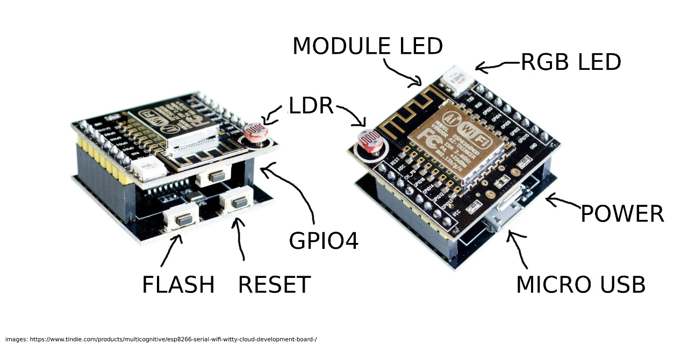

# MicroPython on the Witty Cloud

## The Witty Cloud Module

The Witty Cloud is a small, cheap development board available from many Ebay / AliExpress 
sellers.  It consists of two boards sandwiched together

It is based around an ESP-12F module, which contains an ESP8266 processor, 4MB of flash memory,
an oscillator and a small blue LED.

The upper board has the ESP-12F plus an RGB LED, a pushbutton, a light-dependent resistor (LDR)
and (on the underside) a 3.3V regulator and a micro USB socket (power only).

The lower board has a USB to serial converter, an auto-reset circuit to put the ESP8266 
into flash mode and couple more buttons.

The ESP8266 pins are connected as follows

ESP8266 | Connection
--------|--------------------
RST     | Reset button on lower board
GPIO0   | Flash button on lower board
GPIO1   | TXD from serial converter
GPIO2   | Blue LED on ESP-12F
GPIO3   | RXD from serial converter
GPIO4   | Button on upper board
GPIO5   |
GPIO12  | RGB LED (Blue)
GPIO13  | RGB LED (Green)
GPIO14  | 
GPIO15  | RGB LED (Red)
GPIO16  | 
ADC     | LDR (with pulldown resistor)

The numbering is a bit confusing, but GPIO6 through GPIO11 are used for the onboard
flash and not available from MicroPython or connected to the Witty Cloud board.

## Using the Witty Cloud

While it is a pretty limited board, having the onboard hardware makes it easy for us
to use as a tutorial without having to hook up hardware.

The upper board
can be removed from the lower board and used in your projects directly.
If you want to use the ADC for something other than a light sensor, it is easy to
desolder or cut off the LDR.
It is, annoyingly, slightly too wide to use in a standard mini breadboard,
but works well across two breadboards.

The lower board can also be used, with some jumper wires, as a generic ESP8266
and ESP32 programmer.

## Loading Firmware

The first step is to load the MicroPython firmware onto the board.
There's a serial bootloader build into the ESP8266 already which means we 
don't need anything fancy, just a USB to serial converter (which is already
on the Witty Cloud lower board).

See [Installing MicroPython](installing.md) for details of how to connect to 
the device and load the MicroPython firmware from Linux, OSX and Windows.

## Exercises: Using I/O

See [Inputs and Outputs](inputs-and-outputs.md) for details of how to control
the I/O pins from MicroPython.

1. Experiment with getting the RGB LED to make interesting colours.

2. Animate a rainbow effect by setting RGB values, pausing a moment and then changing them.

3. Work out how to read the button and analog inputs.

4. Have your LED output respond to user input, for example make the colour patterns
   depend on the intensity of light falling on the LDR.

5. Detect the presence of an object near the board by detecting
   changes in light level.  How can you reduce the effects of ambient light?

